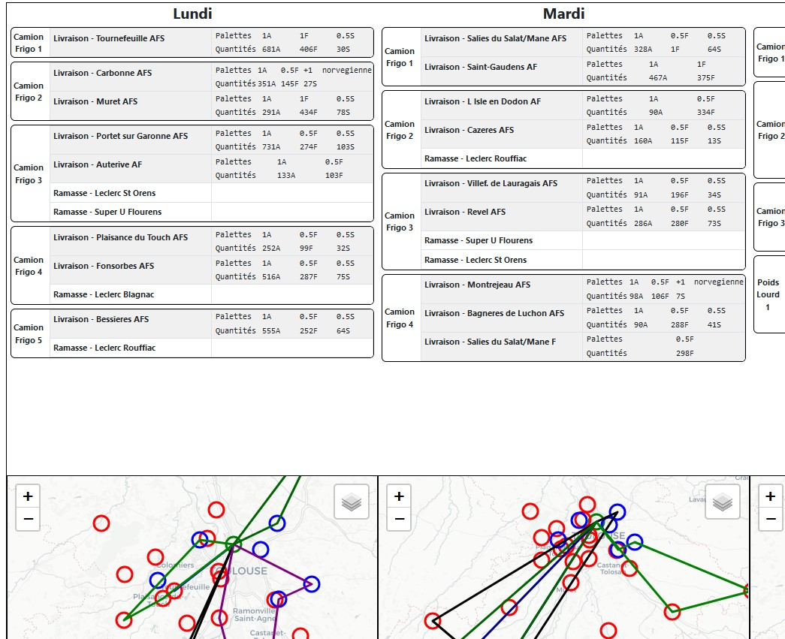

# routage-du-coeur
Optimisation des tournées de véhicules des Restos du Coeur de Haute-Garonne

## Usage

Solve (requires Hexaly solver) :  
```localsolver models/ls_solver.lsp <init solution file or "nil"> <output file path> <week number (1 or 2)>```

Solution checker :  
```python utils/solution_checker.py <solution file> <week number (1 or 2)```

Print the solution to a file :  
```python utils/plots.py <solution file> <week number (1 or 2) <output file>```

[Example Solution](solutions/week_1.yaml)  
  
Example (partial) Plot :  
